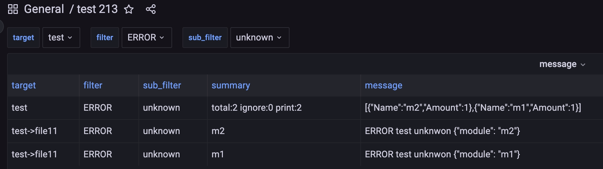
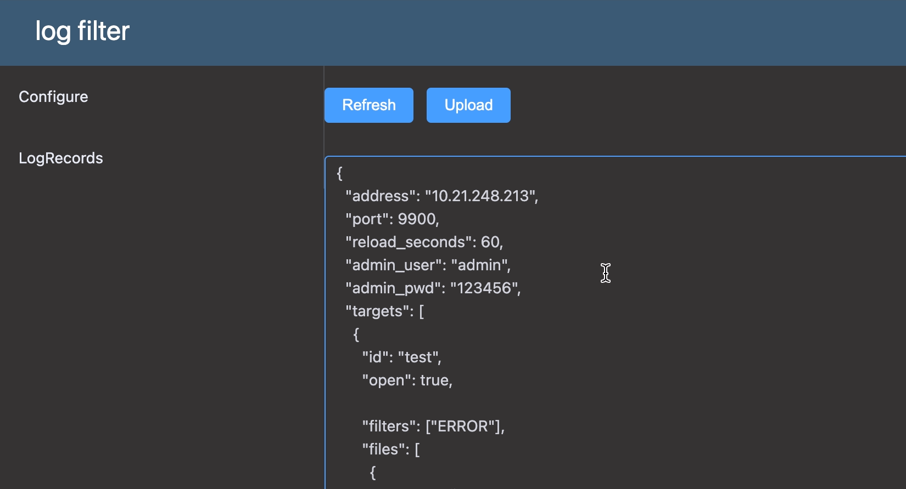
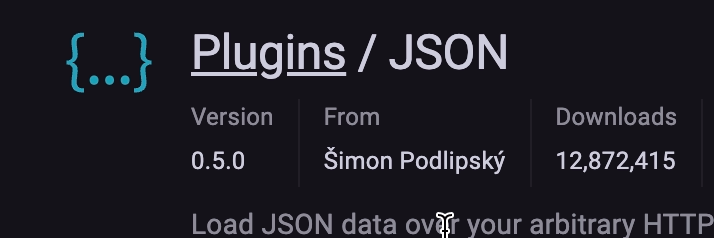
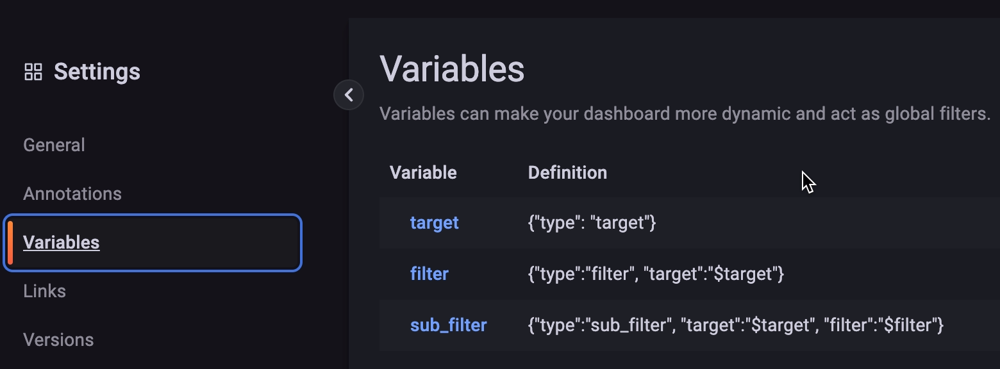
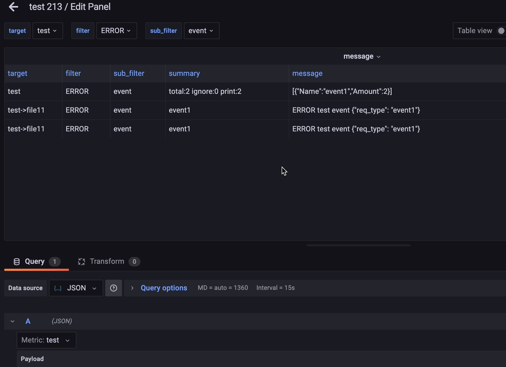

# log filter
* 轻量级的日志过滤分析统计工具，使用grafana展示
* go version: 1.16

## 使用
* 构建`cmds/manager` 并配置`config.json`, 运行在管理机上
* grafana配置
  * 安装`json`插件 
  * 添加json数据源 url: http://127.0.0.1:9900
  * 添加dashboard 配置Variables:
      * name:`target` query:`{"type": "target"}`
      * name:`filter` query:`{"type":"filter", "target":"$target"}`
      * name:`sub_filter` query:`{"type":"sub_filter", "target":"$target", "filter":"$filter"}`
  * 增加panel